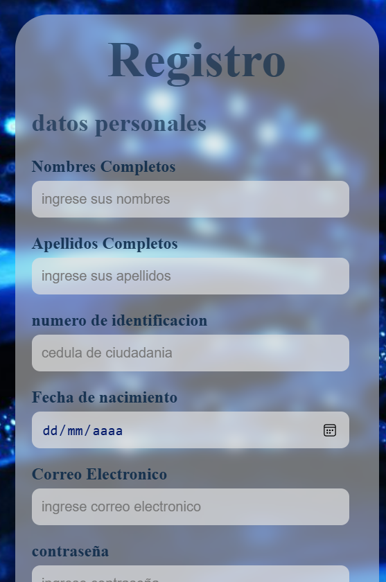

# Proyecto de Interfaz de Login y Registro

Este proyecto consiste en una interfaz web creada con HTML y CSS que incluye secciones separadas para el inicio de sesión (Login) y el registro de nuevos usuarios.

## Cómo empezar

Este proyecto es puramente frontend, por lo que no requiere una instalación compleja. Simplemente necesitas un navegador web para abrir los archivos HTML.

### Prerrequisitos

Asegúrate de tener un navegador web moderno instalado (Chrome, Firefox, Safari, etc.).
